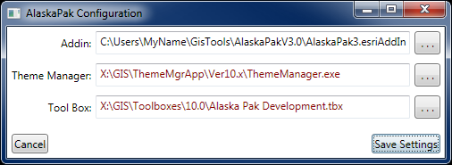
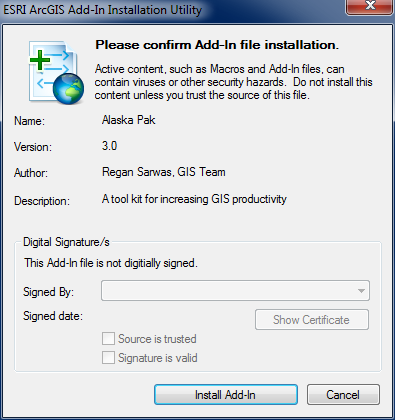
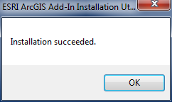
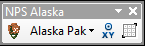
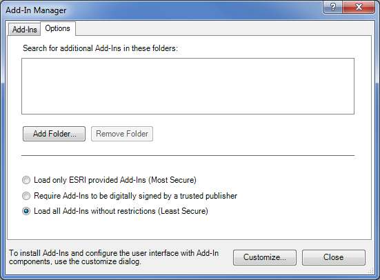

# AlaskaPak v3 Installation Instructions

If you are installing AlaskaPak for personal use on a single computer then
follow the standalone installation instructions. If you want to use AlaskaPak
on multiple computers (either by the same or different users), then follow the
network installation instructions.

*AlaskaPak v3 will only operate properly on a computer with ArcGIS 10.x
(at any license level).  The installation does not check for this, so it is up
to you to know that you have the correct version of ArcGIS.*

## Standalone Installation Instructions

1. Unzip the download file (e.g. `AlaskaPakV3.0.zip`) into a stable local folder
   (for example `C:\Users\MyName\GisTools`).  There should a new folder
   (`AlaskaPakV3.0`) with two files (`AlaskaPak3` and `ConfigurationEditor`)
   and one subfolder (`GPTools`).
2. In the windows explorer, double click the `ConfigurationEditor` file and you
   will see a configuration screen similar to the following:

   

   1. The first line will probably be different and should reflect your location
      of the `AlaskaPak3` Add-In file.  If it does go to step 2.2. The
      configuration editor assumes it is located adjacent to the `AlaskaPak3`
      Add-In file, if this is not the case then fix the first line by browsing
      to the correct location of the `AlaskaPak3` Add-In file.
   2. If you have [NPS Theme Manager](https://github.com/AKROGIS/ThemeManager)
      installed, correct the second line by browsing to the location of NPS
      Theme Manager, if not, then ignore this line.
   3. Correct the third line by browsing to the location of the AlaskaPak
      Toolbox.  For our example, the path would be
      `C:\Users\MyName\GisTools\AlaskaPakV3.0\GPTools\Alaska Pak Development.tbx`.
   4. Once you have the correct file locations, click the `Save Settings`
      button. This will embed your configuration settings inside the
      `AlaskaPak3` Add-In file.
3. In the windows explorer, double click the `AlaskaPak3` Add-In file and you
   will see the following screen:

   

4. Click the `Install Add-In` button, and you should see the following:

   

5. Start ArcMap.
6. If you do not see the following toolbar then go to `Customize -> Toolbars`
   in the main ArcMap menu, and ensure that there is a check box next to
   `NPS Alaska`.

   

## Network Installation Instructions

### Administrators

The following steps only need to be done once by someone with write permission
to a suitable network folder.  A suitable network folder is one that is
accessible to all AlaskaPak users as the same UNC or mapped drive.  In addition,
it is a good idea to make this location read only to prevent unwanted changes to
the AlaskaPak files.

1. Unzip the download file (`AlaskaPak3.zip`) into a suitable network folder.
   There should a new folder (`AlaskaPakV3.0`) with two files (`AlaskaPak3` and
   `ConfigurationEditor`) and one subfolder (`GPTools`).
2. Follow step 2 in the standalone installation instructions to embed the
   appropriate paths into the `AlaskaPak3` Add-In file.  These paths should be
   the same as those used by all users of AlaskaPak.

### ArcMap Users

The following steps need to be done by each person that wants to use AlaskaPak.

1. Open ArcMap. 
2. From the main menu, select `Customize -> Add-In Manager…`.
3. Click on the `Options` tab.

   

4. Click the `Add Folder…` button, and browse to the folder where the
   administrator installed the `AlaskaPak3` Add-In file.
5. When the `AlaskaPak3` Add-In folder is listed in search list, then click the
   `Close` button.
6. On the main menu, select `Customize -> Toolbars` and ensure that there is a
   check box next to `NPS Alaska`.  If `NPS Alaska` is not there, try closing
   and restarting ArcMap.
